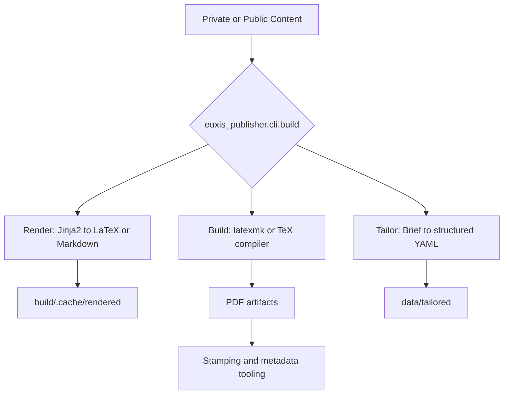

<p align="center">
  
</p>

<h1 align="center">Euxis Publisher</h1>

<p align="center">
  <strong>Public publishing engine for LaTeX-first documents, packaged as a Python CLI and built for macOS, Linux, and WSL.</strong>
</p>

<p align="center">
  <a href="https://github.com/sebastienrousseau/euxis-publisher/actions/workflows/engine-validation.yml"></a>
  <a href="https://github.com/sebastienrousseau/euxis-publisher/actions/workflows/verapdf.yml"></a>
  <a href="https://github.com/sebastienrousseau/euxis-publisher">= 3.11" /></a>
  <a href="https://github.com/sebastienrousseau/euxis-publisher"></a>
  <a href="https://github.com/sebastienrousseau/euxis-publisher/blob/main/LICENSE"></a>
</p>

---

## Install

Run the local bootstrap:

```bash
./bin/setup
```

Then validate the engine:

```bash
make test
make coverage
```

**Requires** `python3`, `git`, and a TeX toolchain. Use WSL for full Windows support. Install `tagpdf.sty` if you need accessibility tagging.

---

## Publish

Publish against the private content repository with the shell-agnostic form:

```bash
make publish CONTENT_DIR=/absolute/path/to/euxis-publisher-private
```

Use the shell-specific form only when you need it:

```bash
# Bash / Zsh / POSIX sh
EUXIS_CONTENT_DIR=/absolute/path/to/euxis-publisher-private make publish

# fish
env EUXIS_CONTENT_DIR=/absolute/path/to/euxis-publisher-private make publish

# PowerShell
$env:EUXIS_CONTENT_DIR = "/absolute/path/to/euxis-publisher-private"
make publish
```

`EUXIS_PUBLISHER_CONTENT_DIR` is **not** supported.

Drop supported briefs into `data/jobs/` in the private content repo, then run
`publish`. The build now promotes `.txt`, `.md`, `.markdown`, `.rtf`, `.doc`,
`.docx`, `.odt`, and `.html` briefs into `data/tailored/` automatically before
compiling PDFs.

---

## Overview

Use this repository as the public engine layer of the Euxis publishing stack.
Keep private content in `euxis-publisher-private`.

You get:

- **LaTeX classes and styles** through `core/cls/` and `core/sty/`
- **Packaged Python entrypoints** through `euxis_publisher/cli/`
- **Operator utilities** through `euxis_publisher/tools/`
- **Compatibility wrappers** through `scripts/`
- **Public fixture content** through `data/`, `src/`, and `templates/`
- **100% package coverage** over `euxis_publisher`

---

## Architecture

First, render or tailor content. Then compile camera-ready output from the same engine.



---

## Features

| | |
| :--- | :--- |
| **Engine** | Packaged Python CLI with `build`, `render`, `blog`, `tailor`, `lint`, and cleanup commands |
| **Typography** | Shared LaTeX classes and style packages for CVs, papers, patents, FAQs, guides, and bios |
| **Build Modes** | Draft, submission, and camera-ready flows managed from one orchestration layer |
| **Publishing** | PDF/A-oriented metadata flow with provenance stamping support |
| **Fixtures** | Public sample content for engine validation without exposing private briefs or templates |
| **Coverage** | 100% package coverage across `euxis_publisher` |
| **Platforms** | macOS, Linux, and WSL |
| **Docs** | Sphinx docs plus folder-level READMEs for every major public surface |

---

## Commands

| Command | Execute this to... |
| :--- | :--- |
| `make list` | inspect registered documents |
| `make draft` | compile all public documents in draft mode |
| `make final` | compile camera-ready output from the current content root |
| `make publish CONTENT_DIR=/absolute/path/to/euxis-publisher-private` | auto-tailor briefs from `data/jobs/` and compile the full private set |
| `make render` | render Jinja2 templates to LaTeX |
| `make render-md` | render Markdown output |
| `make blog` | render blog posts |
| `make tailor BRIEF=data/jobs/job.txt` | generate one tailored document explicitly and build it |
| `make sitemap` | generate `build/site-map.json` |
| `make test` | run the public engine test target |
| `make coverage` | enforce the package coverage gate |
| `make docs` | build the Sphinx site |

Use the packaged CLIs directly when you need lower-level control:

```bash
python3 -m euxis_publisher.cli.build list
python3 -m euxis_publisher.cli.render --doc cv
python3 -m euxis_publisher.cli.sitemap --pretty
python3 -m euxis_publisher.cli.tailor data/jobs/test.txt --no-ai
```

For bulk private publishing, prefer `make publish`. It scans `data/jobs/`,
refreshes stale tailored YAML, and compiles the resulting PDFs in one pass.

---

## Public vs Private Boundary

Keep these surfaces public:

- `core/`
- `euxis_publisher/`
- `scripts/`
- `tests/`
- non-sensitive fixtures in `data/`, `src/`, and `templates/`
- CI, docs, and build metadata

Keep these surfaces private:

- real briefs and client content
- proprietary templates and assets
- content-bearing metadata sets
- content-specific QA and linguistic validation

For the full boundary contract, read [docs/public-private-boundary.md](docs/public-private-boundary.md).

---

## Documentation

Start here:

- [docs/README.md](docs/README.md)
- [docs/architecture.md](docs/architecture.md)
- [docs/classes-and-styles.md](docs/classes-and-styles.md)
- [docs/package-reference.md](docs/package-reference.md)
- [docs/macro-reference.md](docs/macro-reference.md)
- [docs/usage.md](docs/usage.md)
- [docs/testing-and-ci.md](docs/testing-and-ci.md)

Folder guides:

- [bin/README.md](bin/README.md)
- [core/README.md](core/README.md)
- [data/README.md](data/README.md)
- [euxis_publisher/README.md](euxis_publisher/README.md)
- [euxis_publisher/cli/README.md](euxis_publisher/cli/README.md)
- [euxis_publisher/tools/README.md](euxis_publisher/tools/README.md)
- [scripts/README.md](scripts/README.md)
- [src/README.md](src/README.md)
- [templates/README.md](templates/README.md)
- [tests/README.md](tests/README.md)

---

## License

Licensed under the **MIT License**. See [LICENSE](LICENSE) for details.
